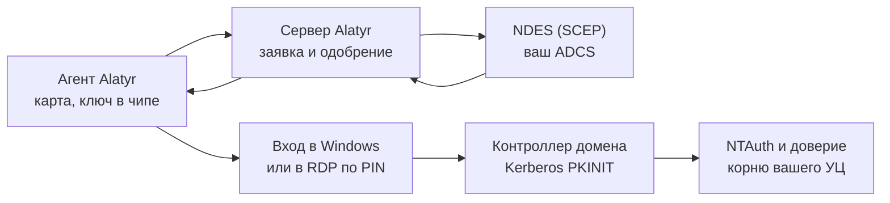

# Вход в домен по смарт-карте

## Что это такое и что вам даёт

Alatyr выдаёт сотруднику сертификат для входа в домен Windows и кладёт его на
смарт-карту, которую агент заводит **на самом устройстве**. Закрытая часть
ключа создаётся внутри чипа машины (TPM 2.0 на Windows и Linux, Secure Enclave
на Mac) и оттуда не извлекается. Сотрудник входит PIN'ом карты, а не доменным
паролем.

Что это меняет на практике:

- **Пароль не участвует во входе.** Контроллер домена выдаёт билет Kerberos по
  сертификату (PKINIT), пароль в сеть не уходит вовсе.
- **Карту не надо покупать и выдавать.** Роль карты играет ключ в чипе
  устройства; физического носителя, который можно забыть или потерять, нет.
- **Тот же порядок, что и у остальных целей Alatyr.** Устройство просит —
  администратор одобряет — сертификат выдан.

Цель выпуска называется `ad_logon`; в интерфейсе — **«Вход в AD»**.

## Как это работает

Агент заводит на устройстве карту и ключ, отправляет заявку с UPN и SID
сотрудника, администратор её одобряет, сервер получает сертификат у вашего
ADCS через SCEP и возвращает его агенту. Дальше Alatyr в цепочке не участвует:
вход выполняет сама Windows, а контроллер домена проверяет сертификат по
своему хранилищу доверия.

## Три стороны настройки

Настройка делается один раз и трогает три разные системы. Две из них ваши.

| Где | Что настраивается | Кто делает |
|---|---|---|
| Active Directory и ADCS | шаблон сертификата, публикация УЦ в NTAuth, доверие корню | администратор домена |
| Alatyr | адрес SCEP, разрешение выдачи, назначение цели устройству, одобрение заявки | администратор Alatyr |
| Устройство сотрудника | PIN карты, а для RDP — проброс карты в сеанс | сотрудник |

Настройку домена Alatyr за вас не делает и делать не будет: смена состава
NTAuth или политики доверия корню действует на **каждый** вход по карте в
домене, а не только на ваше развёртывание. Это разовая операция на срок жизни
УЦ.

!!! warning "Эта цель выписывается только через SCEP/ADCS, не через Vault"
    Для строгого сопоставления сертификата с учётной записью (KB5014754)
    сертификат обязан нести расширение с SID сотрудника. Vault PKI такого
    расширения не выпускает **в принципе**, поэтому сервер требует для «Входа
    в AD» бэкенд SCEP и отклоняет любой другой — независимо от настроек.
    Подробнее — [«Пределы и нюансы»](caveats.md#только-scepadcs-vault-для-этой-цели-не-подходит).

!!! danger "Шаблон обязан брать subject из заявки"
    При SCEP заявителем всегда выступает служебная учётная запись NDES. Если
    шаблон строит имя из каталога, ADCS подставит UPN и SID **этой служебной
    записи** — сертификат выдастся успешно и будет удостоверять не того
    человека. Что именно включить — [шаг 1 настройки](setup.md#шаг-1-подготовьте-шаблон-сертификата-в-adcs).

---

## Куда идти дальше

| Если вам нужно | Читайте |
|---|---|
| Настроить вход по карте с нуля: домен, ADCS, админка, устройство | [Настройка](setup.md) |
| Войти на удалённый рабочий стол по карте — с Windows, Linux или Mac | [Вход по RDP](rdp.md) |
| Узнать, чего механизм не обещает, до того как это выяснится на работающем домене | [Пределы и нюансы](caveats.md) |
| Понять, как устроена выдача сертификатов и почему у каждой цели свой УЦ | [Архитектура и PKI](../architecture.md#pki--ca--per-purpose-registry) |
| Посмотреть сценарий целиком: кто с кем взаимодействует и чья зона ответственности | [Сценарии применения](../use-cases.md#вход-в-домен-windows-по-смарт-карте) |

Читать подряд не обязательно. Для запуска достаточно [настройки](setup.md);
остальное — когда понадобится.
