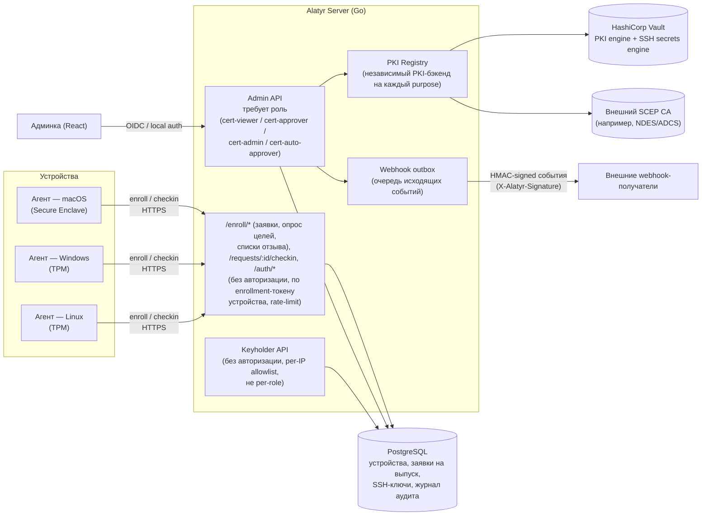
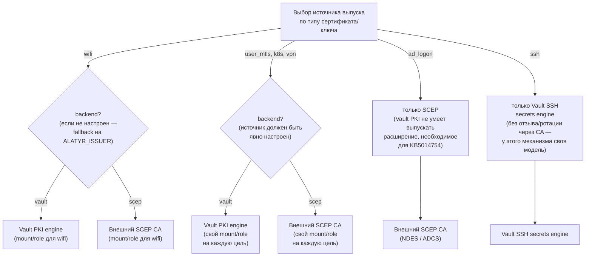

# Архитектура и PKI

Эта страница отвечает на вопрос «как оно устроено внутри»: из чего собран
сервер, кто с кем разговаривает и откуда берутся сертификаты. Для запуска
конкретной цели она не нужна — там всё пошагово: [Wi-Fi и проводной
802.1X](wifi/index.md), [mTLS пользователя](mtls/index.md),
[SSH-доступ](ssh/index.md), [Вход в домен по
смарт-карте](ad-logon/index.md), [Доступ к Kubernetes](k8s/index.md).

## Компоненты и потоки данных

Alatyr состоит из Go-сервера (единственный компонент, обращающийся к базе
данных и внешним PKI-бэкендам), кросс-платформенного агента (macOS/Windows/
Linux) и админки на React. Агент и админка никогда не обращаются к базе
данных или Vault/SCEP напрямую — весь доступ идёт через REST API сервера.

Keyholder API — не самостоятельный сервис, а отдельная группа маршрутов
внутри того же Go-сервера. От Admin API он отличается моделью доступа:
вместо ролей — allowlist по IP и необязательный серверный токен. Целевой
сервер берёт отсюда всё, что ему нужно про SSH: список публичных ключей
пользователя (`AuthorizedKeysCommand`) и список отзыва. Устройство
механизма — [Реестр ключей и Keyholder API](ssh/registry.md).

Заявки на выпуск всегда создаются через неавторизованные
`/enroll*`-эндпоинты (по токену регистрации устройства, не по учётной
записи администратора) и переходят в статус `pending` — ни одна из них не
выпускается прямо при регистрации. Дальше заявку рассматривает
администратор через Admin API, требующий роль `cert-approver`/`cert-admin`,
либо — без участия человека — сервисный аккаунт с ролью
`cert-auto-approver`, машинной ролью наименьших привилегий, которая умеет
только одобрять заявки, проходящие независимую последовательность
проверок (аппаратная аттестация, purpose, corp-ownership и т.д.).

Какие цели такой аккаунт вправе одобрять, задаётся **на каждом токене
отдельно** (`allowed_purposes`). Умолчание — только `wifi`; всё остальное
администратор разрешает явно, и это осознанный размен, а не удобство:
`user_mtls`, `ad_logon`, `ssh` и `k8s` утверждают личность человека.
Подробно про роли и это автоодобрение —
[Администрирование](administration.md#роли). У отдельной подсистемы SSH Key
Registry — своя настройка автоодобрения, см. [Реестр ключей и Keyholder
API](ssh/registry.md). Каждое изменение состояния (одобрение, отзыв, смена
ролей) фиксируется в журнале аудита.

Вебхуки работают через исходящий outbox. События («заявка одобрена»,
«сертификат отозван» и т.п.) складываются в очередь доставки, откуда их
разбирает фоновый воркер: он подписывает тело запроса HMAC-секретом
получателя, отправляет его и при ошибке повторяет попытку с
экспоненциально растущей задержкой. Блокировка на уровне строк позволяет
запускать несколько воркеров параллельно, не дублируя доставку.

## PKI / CA — per-purpose registry

Alatyr не использует единый глобальный CA. Каждый тип сертификата или
ключа настраивается на свой независимый источник выпуска, полностью
отдельно от остальных. Целей шесть: `wifi`, `user_mtls`, `ad_logon`,
`ssh`, `k8s` и `vpn`.

Каждый purpose (цель выпуска) настраивается отдельной строкой `issuer_profiles` — можно
держать `wifi` на Vault, а `ad_logon` на корпоративном NDES/ADCS
одновременно. `wifi` — единственный purpose с fallback-поведением: если
для него нет строки в `issuer_profiles` (или она выключена), сервер
использует issuer, заданный переменной окружения `ALATYR_ISSUER`
(по умолчанию `vault`, но может быть и `scep` — см.
[Конфигурация](configuration.md#pki-issuer-vault--внешний-scep-ca)),
сконфигурированный при старте, — это гарантирует, что развёртывания без
per-purpose PKI работают без изменений. У остальных целей такого fallback
нет: без явно настроенного и включённого профиля выпуск для них
отклоняется. Выключенный профиль при этом равен отсутствующему — это и
есть способ отключить цель, не удаляя её настройки.

`ad_logon` — единственный purpose с жёстко зафиксированным источником
выпуска (как это настраивается на практике — [Вход в домен по смарт-карте →
Настройка](ad-logon/setup.md)): сервер всегда требует SCEP для этого purpose,
независимо от настроек, потому что Vault PKI не умеет выпускать расширение
сертификата, необходимое для strong certificate mapping (KB5014754) —
без него Windows-логин по смарт-карте не пройдёт строгую проверку
соответствия. SSH устроен похоже, но ещё строже: OpenSSH-сертификат —
не X.509 (подписывается сырой публичный ключ, а не запрос на
сертификат), и у выпуска SSH-сертификатов нет операции отзыва или
ротации CRL в принципе — у Vault SSH secrets engine такой концепции
попросту нет. Поэтому для purpose `ssh` источником выпуска может быть
только Vault SSH secrets engine — любая другая настройка для этого
purpose считается ошибкой конфигурации.

**Отзыв.** Механизма три, и у каждой цели свой.

- **`wifi`, `user_mtls`, `ad_logon`, `vpn` — стандартный путь CA
  (CRL/OCSP).** Дотягивается он ровно настолько, насколько приёмник его
  проверяет: отзыв у CA не принуждает RADIUS или прокси перепроверить
  сертификат. Настроить перечитывание списка отзыва — задача приёмника.
- **`ssh` — Key Revocation List (KRL).** Пути CA здесь нет вообще:
  OpenSSH-сертификат — не X.509, и CRL/OCSP у него не существует. Сервер
  отдаёт список отозванных ключей в стандартном бинарном формате OpenSSH
  (`PROTOCOL.krl`), формируемый на каждый запрос; `sshd` перечитывает его
  через директиву `RevokedKeys`. Тот же KRL доступен по двум адресам с
  разной моделью доступа: `GET /api/v1/ssh/krl` (роль администратора) и
  `GET /api/v1/keyholder/krl` (allowlist по IP — им и пользуется целевой
  сервер). У реестра «сырых» ключей отзыв ещё проще: отозванный ключ
  просто перестаёт возвращаться.
- **`k8s` — отказ в следующей выдаче.** Kubernetes отзыв не проверяет
  вовсе, ни CRL, ни OCSP. Отзыв внутри Alatyr останавливает выпуск
  следующего десятиминутного credential, а уже выданный доживает свой
  срок.

Как это выглядит на практике, за сколько действует отзыв и что для этого
надо настроить на вашей стороне — в разделах целей: [mTLS → Отзыв
доступа](mtls/revocation.md), [SSH → Отзыв доступа](ssh/revocation.md),
[Kubernetes → Нюансы и пределы](k8s/caveats.md#кластер-не-проверяет-отзыв).
