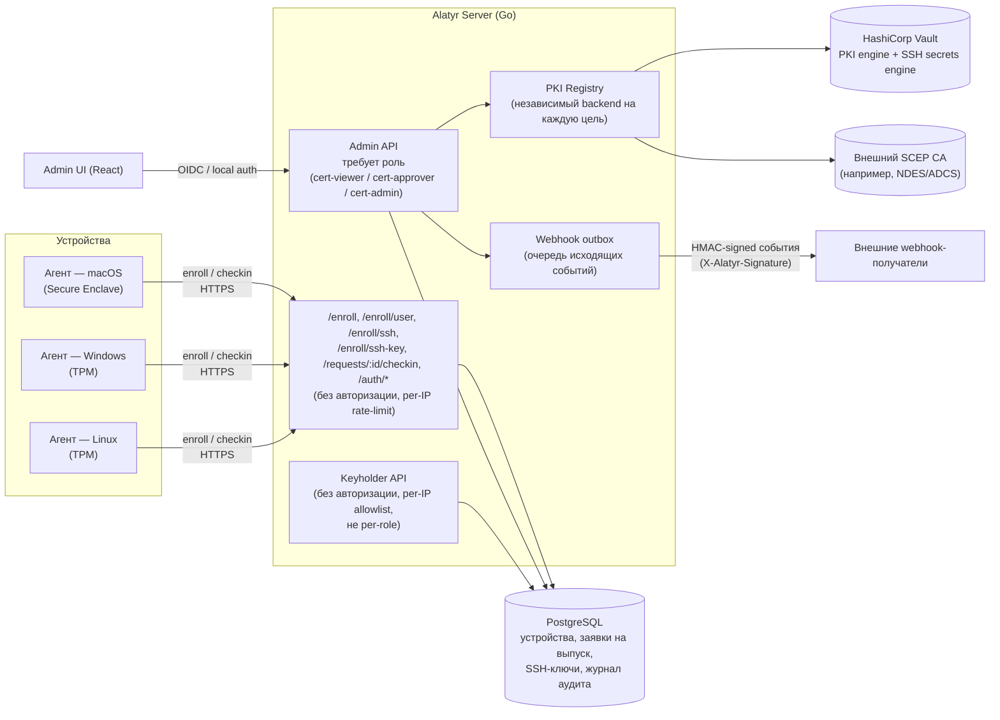
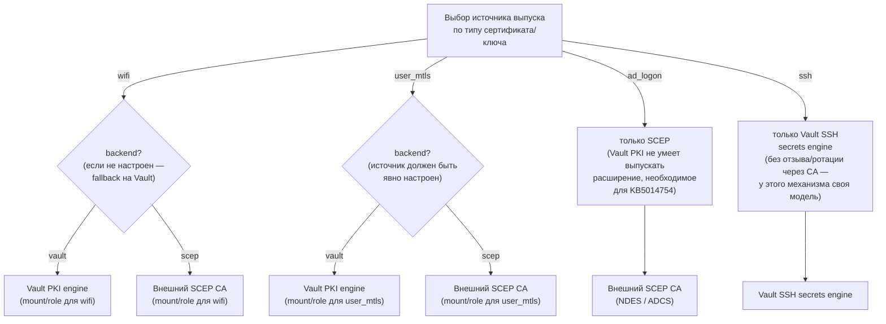

# Архитектура

## Компоненты и потоки данных

Alatyr состоит из Go-сервера (единственный компонент, обращающийся к базе
данных и внешним PKI-бэкендам), кросс-платформенного агента (macOS/Windows/
Linux) и Admin UI на React. Агент и Admin UI никогда не обращаются к базе
данных или Vault/SCEP напрямую — весь доступ идёт через REST API сервера.

Keyholder API — не отдельный, внешний по отношению к остальной системе
сервис, а отдельная группа маршрутов того же Go-сервера, со своей моделью
доступа (per-IP allowlist вместо ролей) вместо обычной авторизации Admin
API. `sshd` на каждом хосте опрашивает его через `AuthorizedKeysCommand`,
чтобы получить актуальный список публичных SSH-ключей зарегистрированного
пользователя из PostgreSQL.

Заявки на выпуск всегда создаются через неавторизованные
`/enroll*`-эндпоинты (по токену регистрации устройства, не по учётной
записи администратора) и переходят в статус `pending`; их рассматривает
администратор через Admin API, требующий роль `cert-approver`/`cert-admin`.
Сертификатный SSH не выпускается автоматически: `/enroll/ssh`, как и
`/enroll/user`, всегда оставляет заявку в `pending`. У отдельной
подсистемы SSH Key Registry — своя настройка автоодобрения, см.
[SSH Key Registry](ssh-keys.md). Каждое изменение состояния (одобрение, отзыв,
смена ролей) фиксируется в журнале аудита.

Вебхуки — исходящий outbox: события (например, «заявка одобрена»,
«сертификат отозван») складываются в очередь доставки, а фоновый воркер
вычитывает готовые к отправке события — блокировка на уровне строк
позволяет запускать несколько воркеров параллельно без дублирования
доставки, — подписывает тело запроса HMAC-секретом получателя и
ретраит с экспоненциальным backoff при ошибке.

## PKI / CA — per-purpose registry

Alatyr не использует единый глобальный CA. Каждый тип сертификата или
ключа (`wifi`, `user_mtls`, `ad_logon`, `ssh`) настраивается на свой
независимый источник выпуска, полностью отдельно от остальных:

Каждый purpose настраивается отдельной строкой `issuer_profiles` — можно
держать `wifi` на Vault, а `ad_logon` на корпоративном NDES/ADCS
одновременно. `wifi` — единственный purpose с fallback-поведением: если
для него нет строки в `issuer_profiles` (или она выключена), сервер
использует Vault-issuer, сконфигурированный переменными окружения при
старте — это гарантирует, что развёртывания без per-purpose PKI работают
без изменений. У `user_mtls`, `ad_logon` и `ssh` такого fallback нет:
без явно настроенного и включённого профиля выпуск для этих целей
отклоняется.

`ad_logon` — единственная цель с жёстко зафиксированным источником
выпуска: сервер всегда требует SCEP для этой цели, независимо от
настроек, потому что Vault PKI не умеет выпускать расширение
сертификата, необходимое для strong certificate mapping (KB5014754) —
без него Windows-логин по смарт-карте не пройдёт строгую проверку
соответствия. SSH устроен похоже, но ещё строже: OpenSSH-сертификат —
не X.509 (подписывается сырой публичный ключ, а не запрос на
сертификат), и у выпуска SSH-сертификатов нет операции отзыва или
ротации CRL в принципе — у Vault SSH secrets engine такой концепции
попросту нет. Поэтому для цели `ssh` источником выпуска может быть
только Vault SSH secrets engine — любая другая настройка для этой
цели считается ошибкой конфигурации.

**Отзыв.** У `wifi`/`user_mtls`/`ad_logon` — стандартный путь CA
(CRL/OCSP). У `ssh` такого пути нет вообще: единственное средство
отзыва — Key Revocation List (KRL, `GET /api/v1/ssh/krl`), который
сервер формирует по списку отозванных ключей в стандартном бинарном
формате OpenSSH (`PROTOCOL.krl`) при каждом запросе; `sshd` регулярно
перечитывает файл через директиву `RevokedKeys`.
