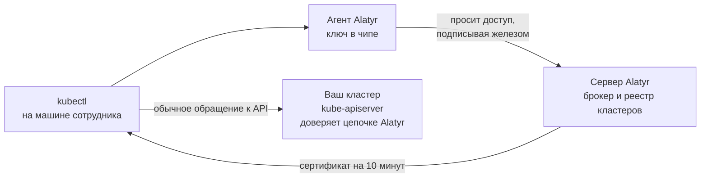

# Доступ к Kubernetes

## Что это такое и что вам даёт

Alatyr выдаёт сотруднику доступ к кластеру и сам решает, действует этот доступ
или уже нет. `kubectl` при этом работает обычной командой — он не знает ни про
TPM, ни про Alatyr.

Заменяется этим одна практика: kubeconfig с вшитым клиентским сертификатом,
собранный руками и отправленный человеку. Разница — в четырёх местах:

| | kubeconfig, розданный руками | доступ через Alatyr |
|---|---|---|
| Где лежит закрытый ключ | файлом на диске у сотрудника — его копирует каждый бэкап и каждый клон | в чипе устройства (TPM на Windows и Linux, Secure Enclave на Mac), не извлекается |
| Сколько действует то, что видит кластер | обычно год, часто дольше | **10 минут**, выписывается заново на каждый вызов `kubectl` |
| К чему привязан доступ | ни к чему — работает с любой машины, куда файл скопировали | к устройству и к сотруднику, которого одобрил администратор |
| Кто и когда ходил в кластер | нигде не записано | запись в журнале на **каждую** выдачу: кто, с какого устройства, в какой кластер, когда |

Последняя строка обычно и оказывается решающей: с розданным руками kubeconfig
вопрос «кто ходил в production» не восстанавливается вовсе — ни полностью, ни
частично.

## Как это работает

Сотрудник набирает `kubectl get pods`. `kubectl` сам вызывает агента Alatyr,
тот подписывает запрос ключом из чипа, сервер Alatyr проверяет, что доступ ещё
действует, и выдаёт сертификат на десять минут. Этот сертификат `kubectl` и
предъявляет вашему кластеру. Кластер проверяет цепочку доверия и читает из
сертификата имя сотрудника — дальше решает ваш RBAC.

## Два сертификата, а не один

Это главное, что нужно понимать про раздел. В схеме участвуют **два разных**
сертификата, и путать их нельзя: у них разный срок жизни, разный владелец и
разный способ забрать доступ.

| | **Идентичность** | **Эфемерный сертификат** |
|---|---|---|
| Кому предъявляется | только серверу Alatyr | вашему кластеру |
| Где живёт закрытый ключ | в чипе устройства | только в памяти `kubectl` и агента, на диск не попадает |
| Срок жизни | год | **10 минут** |
| Кто его одобряет | администратор — **один раз** на идентичность | никто — выписывается автоматически, если доступ ещё действует |

Идентичность — это «основание»: то, что администратор одобрил один раз.
Эфемерный сертификат выписывается на каждый вызов `kubectl`, и перед каждой
выдачей сервер Alatyr заново проверяет, что основание ещё живо: одобрение не
отозвано, устройство не заблокировано, цель `k8s` устройству назначена, место
по лицензии на месте, а кластер есть в реестре и включён. Отозвали любое из
этого — следующей выдачи не будет.

!!! warning "Кластер не проверяет отзыв — вообще никак"
    API-сервер Kubernetes при проверке клиентского сертификата смотрит цепочку
    и читает имя. Ни CRL, ни OCSP он не спрашивает — такой проверки у него нет
    в принципе. Поэтому единственное, что забирает уже выданный доступ на
    стороне кластера, — истечение срока, и именно поэтому тот сертификат живёт
    десять минут.

    Точная формулировка: после отзыва **новый** доступ прекращается в пределах
    десяти минут. Уже установленные соединения продолжают работать. Подробнее —
    [«Нюансы и пределы»](caveats.md).

## Две половины, и вторая не автоматизируется

Alatyr выдаёт сертификат. Значит он что-то или нет — решает кластер, и Alatyr
эту половину намеренно **не** настраивает: она меняет то, как ваш API-сервер
аутентифицирует всех подряд, а такое решение не принимают за вас.

| Половина | Кто делает |
|---|---|
| Идентичность в чипе, заявка, одобрение, выдача, отзыв, журнал | Alatyr |
| Реестр кластеров: куда ходить и какому CA доверять | Alatyr (заполняет администратор) |
| Доверие цепочке Alatyr в `kube-apiserver` (`--client-ca-file`) | Вы |
| RBAC: что этому человеку можно в кластере | Вы |

Ни одна половина не работает без другой.

## Что работает на каких платформах

Сама выдача доступа — на всех трёх платформах. Расходятся две вещи, и обе
стоит знать до внедрения:

| | Windows | macOS | Linux |
|---|---|---|---|
| Идентичность в чипе и выдача credential для `kubectl` | да | да | да |
| [Локальный прокси](delivery.md#режим-2-локальный-прокси) — второй режим доставки | нет | нет | да |
| [Подтверждение человеком](caveats.md#подтверждение-человеком) при выдаче | да | **нет** | да |

Строка про подтверждение — не косметика: на macOS спросить человека пока
нечем, поэтому если вы подняли эту ступень, на macOS выдача **отказывается**, а
не идёт молча. Разбор — в [«Нюансах и пределах»](caveats.md).

---

## Куда идти дальше

| Если вам нужно | Читайте |
|---|---|
| Настроить доступ с нуля: что сделать в кластере, что в админке и что на рабочей машине | [Настройка](setup.md) |
| Понять, чем отличаются два способа доставки credential в `kubectl` и какой выбрать | [Два режима доставки](delivery.md) |
| Узнать, чего механизм не обещает, до того как это выяснится на работающем кластере | [Нюансы и пределы](caveats.md) |

Читать подряд не обязательно. Для запуска достаточно [настройки](setup.md);
остальное — когда понадобится.
