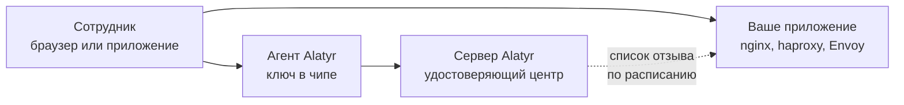

# mTLS пользователя

## Что это такое и что вам даёт

Сотрудник открывает внутреннее приложение — портал, вики, панель сервиса — и
попадает внутрь **без пароля**. Вместо пароля приложение проверяет сертификат.
Закрытая часть сертификата лежит **внутри чипа** рабочей машины или на
смарт-карте и оттуда не извлекается: её нельзя ни скопировать на флешку, ни
отправить в мессенджере.

Что это меняет на практике:

- **Нечего украсть и нечего переслать.** Пароля нет, файла с ключом нет.
  Фишинговой странице нечего выманить: сотруднику просто нечего в неё ввести.
- **Ваше приложение узнаёт человека, а не браузер.** В сертификате записана
  корпоративная личность, и приложение получает её при подключении.
- **Доступ забирается из интерфейса.** Вы нажимаете «Отозвать» в
  веб-интерфейсе Alatyr (дальше — админка), и приложение перестаёт пускать.
- **Вход подтверждает сам сотрудник.** Сертификат защищён отпечатком,
  PIN-кодом устройства или PIN-кодом карты: ключ ничего не подпишет, пока
  сотрудник не подтвердит.

Настройка делается один раз и состоит из двух частей: что нажать в админке и
что прописать в вашем приложении.

## Как это работает

Сертификат выдаёт Alatyr. Дальше ваше приложение проверяет его само: цепочку
доверия и список отзыва. В момент входа оно в сеть не ходит и Alatyr ни о чём
не спрашивает, поэтому пускает сотрудников, даже когда сервер Alatyr
недоступен. Список отзыва приложение забирает заранее, по расписанию.

## Главное, что нужно знать до настройки

!!! danger "Общий удостоверяющий центр с `wifi` — и защиты нет вовсе"
    Сертификаты `user_mtls` и `wifi` обязан выписывать **разный**
    удостоверяющий центр. Пока центр у них общий, всё описанное выше не
    работает вовсе.

    Вот почему. `wifi` — это сертификат машины: Alatyr выдаёт его молча,
    ничего не спрашивая у сотрудника, и лежит он на той же самой машине.
    А различить два сертификата ваше приложение может только по одному
    признаку — **кто их подписал**. Подписал один и тот же центр, значит
    сертификат машины для приложения неотличим от пользовательского. Тогда
    любая программа на машине предъявит его и войдёт как сотрудник: без
    отпечатка, без PIN-кода, без ведома человека.

    Обычная настройка mTLS (`ssl_verify_client on` в nginx, проверка по
    умолчанию в Envoy) смотрит на цепочку доверия и на `clientAuth`. Оба
    сертификата это проходят, поэтому ни одна из этих проверок вас не спасёт.

    [Как развести центры — в настройке](setup.md#шаг-1-отдельный-удостоверяющий-центр-для-цели).

!!! warning "Без списка отзыва отзыв не действует"
    Ваше приложение узнаёт об отозванном сертификате только из списка отзыва.
    Пока списка нет, приложение пускает по отозванному сертификату до самого
    конца его срока. Что для этого настроить — в [«Отзыве
    доступа»](revocation.md).

## Куда идти дальше

| Если вам нужно | Читайте |
|---|---|
| Настроить mTLS с нуля: развести удостоверяющие центры, разрешить выдачу, научить ваше приложение проверять сертификат | [Настройка](setup.md) |
| Забрать доступ у сотрудника и убедиться, что вход действительно закрылся | [Отзыв доступа](revocation.md) |
| Узнать, чего механизм не обещает, до того как это выяснится на работающем приложении | [Нюансы и пределы](caveats.md) |
| Взять готовые настройки haproxy, nginx и OpenVPN, проверенные на живых приёмниках | [Приёмники сертификатов](../relying-parties.md) |

Читать подряд не обязательно. Для запуска достаточно [настройки](setup.md);
остальное — когда понадобится.
