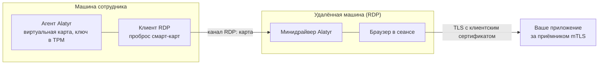

# mTLS внутри RDP-сессии

## Что это и когда нужно

Сотрудник работает на удалённом рабочем столе — подключился по RDP к
терминальному серверу или своей рабочей машине — и оттуда открывает
внутреннее приложение, которое требует сертификат `user_mtls`. Ключ
сертификата живёт в чипе **его** машины, а браузер запущен на **удалённой**.
Чтобы приложение пустило, ключ должен стать доступен в удалённом сеансе, не
покидая чипа.

Делается это пробросом смарт-карты. Агент Alatyr на машине сотрудника
держит виртуальную смарт-карту с ключом в TPM. Клиент RDP перенаправляет
карту в удалённый сеанс, Windows на той стороне видит её как обычную
смарт-карту, а браузер предлагает с неё сертификат. Каждую подпись делает
чип на машине сотрудника, а PIN карты спрашивается в удалённом сеансе.



Это тот же механизм, что [вход в домен по карте через RDP](../ad-logon/rdp.md),
и на одной карте живут оба сертификата: для входа (`ad_logon`) и для
mTLS (`user_mtls`). Входить по карте для mTLS не обязательно — в сеанс можно
войти и паролем, карта всё равно будет проброшена.

!!! note "Главное условие — ступень «PIN самой карты»"
    В удалённый сеанс уезжает только **карта**. Сертификат `user_mtls`
    оказывается на ней, только если в профиле издателя `user_mtls` выбрана
    защита ключа **«PIN самой карты»**. При других ступенях ключ лежит в
    обычном контейнере на машине сотрудника и в удалённый сеанс не
    попадает.

Пробросом пользуется **Windows** на машине сотрудника. С Linux и macOS
клиентская сторона та же, что у входа в домен, и упирается в те же
ограничения клиентов — см. [«С Linux»](../ad-logon/rdp.md#с-linux) и
[«С macOS»](../ad-logon/rdp.md#с-macos).

## Что делает администратор

### Шаг 1. Ключ `user_mtls` — на карту

Откройте **Настройки → Удостоверяющие центры**, профиль цели `user_mtls`, и
в поле **«Защита ключа»** выберите **«PIN самой карты»**. Для `user_mtls`
это значение по умолчанию; проверьте, что его не сменили.

Сделайте это **до** выдачи: ступень применяется к ключу в момент его
создания. Если сертификат уже выдан с другой ступенью, после смены
перевыпустите его — `alatyr-agent reissue user_mtls` на машине сотрудника.

Остальное — как в [настройке mTLS](setup.md): отдельный УЦ, разрешение
выдачи, назначение цели, одобрение заявки, настройка приложения.

**Результат.** У сотрудника выдан `user_mtls`, и на его машине

```
certutil -silent -scinfo
```

показывает карту Alatyr с сертификатом, у которого в SAN адрес почты
сотрудника.

### Шаг 2. Подготовьте удалённую машину

На машине, **куда** подключаются, нужен минидрайвер Alatyr — без него
Windows не сможет читать проброшенную карту. Считыватель там не нужен,
только регистрация (от администратора):

```
alatyr-agent install-reader --minidriver-only
```

Проверьте, что работает служба смарт-карт: `sc.exe query SCardSvr` —
`RUNNING`. Если минидрайвер регистрировали при уже запущенной службе, а
карта в сеансе не видна, перезапустите службу: `Restart-Service SCardSvr`.

Подробнее про удалённую машину (NLA, Remote Credential Guard) — [«Вход по
RDP», шаг 1](../ad-logon/rdp.md#шаг-1-подготовьте-машину-цель). Для mTLS
обязательна только регистрация минидрайвера.

### Шаг 3. Разрешите проброс смарт-карт

Проброс смарт-карт в RDP разрешён по умолчанию. Если в вашей групповой
политике он запрещён, разрешите его для нужных машин: **Computer
Configuration → Administrative Templates → Windows Components → Remote
Desktop Services → Remote Desktop Session Host → Device and Resource
Redirection → «Do not allow smart card device redirection»** — «Не задано»
или «Отключено».

## Что делает сотрудник

1. **Один раз** включает проброс карты в умолчаниях клиента RDP:

    ```
    alatyr-agent rdp --enable-redirect
    ```

    Команда правит `%USERPROFILE%\Documents\Default.rdp` и сообщает, что
    изменила. То же можно сделать в `mstsc`: **Показать параметры →
    Локальные ресурсы → Подробнее → Смарт-карты**.

2. Подключается обычным способом: `mstsc /v:<имя машины>`. В диалоге
   согласия «Unknown remote connection» отмечает **«Smart cards or Windows
   Hello for Business»** — Windows сбрасывает эту галочку при каждом
   запуске ([почему](../ad-logon/rdp.md#шаг-3-подключитесь)).

3. В удалённом сеансе открывает приложение в браузере. Браузер предлагает
   выбрать сертификат — нужен тот, где выдан **Alatyr User mTLS Issuing CA**.
   Windows спрашивает **PIN карты**; в окне агента на машине сотрудника
   появляется запрос «Alatyr: использовать смарт-карту — …».

PIN спрашивается один раз за запуск агента. Окна «не беспокоить» у карты
нет: подтверждение здесь — сам PIN.

## Как проверить

**В удалённом сеансе:**

```
certutil -silent -scinfo
```

Карта видна, на ней два сертификата — для входа в домен (если выдан
`ad_logon`) и для mTLS, с адресом почты в SAN. Если карты нет, проброс не
включён (шаг 3 сотрудника) или на машине нет минидрайвера (шаг 2
администратора).

**Приложение пускает.** Откройте его в браузере удалённого сеанса: после
PIN карты оно видит личность сотрудника (`X-MTLS-User` в примере
[настройки приёмника](setup.md#шаг-5-настройте-ваше-приложение)). Тем же
путём можно проверить командой в PowerShell сеанса:

```powershell
$cert = Get-ChildItem Cert:\CurrentUser\My |
    Where-Object { $_.Issuer -like '*Alatyr User mTLS Issuing CA*' }
Invoke-WebRequest https://app.internal.example.com/ -Certificate $cert
```

Перед раскаткой на парк проверьте путь на одной паре машин: клиентская
машина сотрудника и та удалённая, куда он будет подключаться.

## Если не работает

**В сеансе нет карты (`certutil -scinfo` пусто).** Не отмечена галочка
«Smart cards» в диалоге согласия, проброс запрещён политикой, либо на
удалённой машине не зарегистрирован минидрайвер.

**Карта есть, а сертификата mTLS на ней нет.** Сертификат `user_mtls` выдан
со ступенью, отличной от «PIN самой карты», — ключ лежит в обычном
контейнере. Смените ступень (шаг 1) и перевыпустите сертификат.

**Браузер не предлагает сертификат.** Проверьте, что сертификат виден в
`Cert:\CurrentUser\My` удалённого сеанса, и что приложение просит
клиентский сертификат от того же корня.

**Приложение отвечает `403`.** Браузер предъявил не тот сертификат —
например, сертификат входа в домен с той же карты. Выберите сертификат,
выданный `Alatyr User mTLS Issuing CA`.

## Что дальше

- [Вход по RDP](../ad-logon/rdp.md) — та же карта для входа в удалённый сеанс.
- [Настройка mTLS](setup.md) — приёмник и проверка обеих половин.
- [Нюансы и пределы](caveats.md) — чего механизм не обещает.
