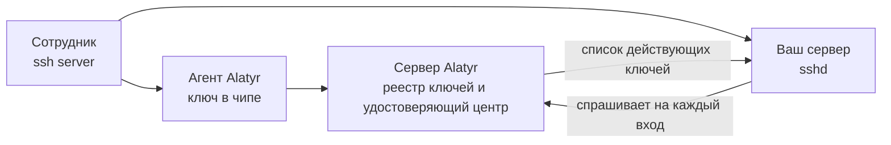

# SSH-доступ

## Что это такое и что вам даёт

Alatyr выдаёт сотруднику ключ для входа по SSH и сам решает, действует этот
ключ или уже нет. Закрытая часть ключа создаётся **внутри чипа** рабочей
машины (TPM на Windows и Linux, Secure Enclave на Mac) и оттуда не
извлекается: её нельзя ни скопировать на флешку, ни отправить в мессенджере.

Что это меняет на практике:

- **Файлов с ключами больше нет.** Сотруднику нечего терять и нечего
  пересылать. Ключ привязан к машине, а не к файлу.
- **Доступ забирается из интерфейса.** Не нужно обходить серверы и чистить
  `authorized_keys` — вы нажимаете «Отозвать» в веб-интерфейсе Alatyr
  (дальше — админка).
- **Видно, кто и чем входит.** У каждого ключа есть владелец, устройство и
  история.

Настройка делается один раз и состоит из двух частей: что нажать в админке и
что положить на ваш сервер.

## Как это работает

Сотрудник набирает обычную команду `ssh`. Подпись делает агент Alatyr —
программа, установленная на машине сотрудника, — ключом из чипа. Ваш сервер в
момент входа спрашивает у сервера Alatyr, действует ли этот ключ: действует —
пускает, нет — отказывает.

## Два способа впустить — и зачем нужны оба

В Alatyr есть два независимых механизма. Они не заменяют друг друга: у
каждого своя сильная сторона.

- **Ключ из реестра.** Сервер Alatyr ведёт список действующих ключей. Ваш
  сервер спрашивает этот список на каждый вход.
- **Сертификат.** Сервер Alatyr подписывает ключ сотрудника, а ваш сервер
  проверяет подпись сам и в сеть за этим не ходит. Про отозванные сертификаты
  он узнаёт из списка отзыва — файла, который обновляется по расписанию.

| | **Ключ из реестра** | **Сертификат** |
|---|---|---|
| Кто решает, впустить ли | сервер Alatyr, на каждый вход | ваш сервер сам, по подписи |
| Как быстро действует отзыв | немедленно | когда ваш сервер обновит список отзыва |
| Нужна ли связь с Alatyr при входе | да | нет |
| Срок жизни | пока не отзовут | 24 часа |

!!! warning "Сертификат не продлевается сам"
    Через сутки он истекает, и вход по нему прекращается. Агент выпускает
    новый не по сроку, а когда меняется ключ, — то есть на продление
    полагаться нельзя. Ключ из реестра этим не затронут: у него срока нет
    вовсе, и он работает, пока его не отзовут.

**Что выбрать.** Включайте оба. Реестр даёт мгновенный отзыв, а сертификат
продолжает пускать сотрудников, даже если сервер Alatyr недоступен. Пошаговая
[настройка](setup.md) описывает оба.

!!! warning "Одна директива `AuthorizedKeysCommand` на область"
    У `sshd` может быть только **одна** директива `AuthorizedKeysCommand` на
    область — то есть одна на весь файл настроек плюс по одной внутри каждого
    блока `Match`. Вторую в той же области `sshd` молча пропустит. Если на
    вашем сервере уже настроен другой источник ключей (например, FreeIPA),
    прочитайте [«Совмещение с FreeIPA»](freeipa.md) **до начала работ** —
    иначе новая настройка молча отключит старую.

---

## Куда идти дальше

| Если вам нужно | Читайте |
|---|---|
| Настроить SSH-доступ с нуля: что нажать в админке и что положить на ваш сервер | [Настройка](setup.md) |
| Забрать доступ у сотрудника или разобраться, почему отзыв не подействовал | [Отзыв доступа](revocation.md) |
| Узнать, чего механизм не обещает, до того как это выяснится на работающем сервере | [Нюансы и пределы](caveats.md) |
| Подключить Alatyr там, где ключи уже раздаёт FreeIPA или другой источник | [Совмещение с FreeIPA](freeipa.md) |
| Разобраться в устройстве: эндпоинты, форматы, токены | [Реестр ключей и Keyholder API](registry.md) |

Читать подряд не обязательно. Для запуска достаточно [настройки](setup.md);
остальное — когда понадобится.
