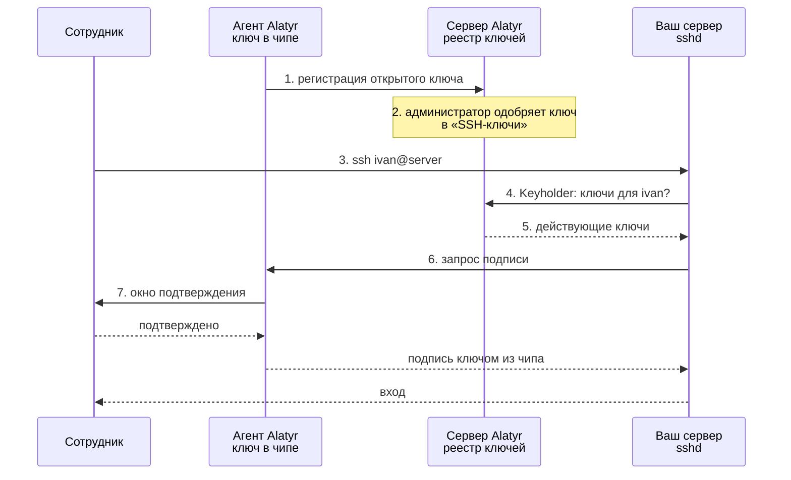

# SSH-ключ без сертификата (`ssh_key`)

## Что это и чем отличается от цели `ssh`

В Alatyr две цели для входа по SSH, и они независимы друг от друга:

- **`ssh` — SSH-сертификат.** Сервер Alatyr подписывает ключ сотрудника
  своим SSH-УЦ на сутки. Ваш `sshd` проверяет подпись сам, по
  `TrustedUserCAKeys`, и в сеть за этим не ходит.
- **`ssh_key` — SSH-ключ без сертификата.** Ничего не подписывается:
  открытый ключ из чипа регистрируется в **реестре ключей** Alatyr. Ваш
  `sshd` на каждый вход спрашивает реестр через Keyholder, действует ли
  ключ.

| | `ssh` — сертификат | `ssh_key` — ключ из реестра |
|---|---|---|
| Что получает устройство | сертификат на 24 часа | ничего: ключ просто зарегистрирован |
| Как проверяет ваш сервер | `TrustedUserCAKeys` и список отзыва KRL | `AuthorizedKeysCommand` → Keyholder, на каждый вход |
| Как быстро действует отзыв | когда сервер обновит KRL | немедленно |
| Нужна ли связь с Alatyr при входе | нет | да |
| Как включается | «Политика выдачи» → «SSH» и назначение цели `ssh` | назначение «SSH-ключ (без сертификата)» на устройстве |
| Где одобряется | «Запросы» | «SSH-ключи» |
| Ключ в чипе | свой | **отдельный**, не тот, что у сертификата |

Включать можно одну цель или обе — [обзор раздела](index.md#два-способа-впустить--и-зачем-нужны-оба)
объясняет, зачем обычно нужны обе. Эта страница — про `ssh_key` целиком:
что делает администратор, что делает агент, что видит сотрудник и как
проверить, что вход работает.

## Как это работает



Закрытая часть ключа создаётся в чипе (TPM на Windows и Linux, Secure
Enclave на Mac) и оттуда не извлекается. Подпись делает агент через свой
ssh-agent, и каждое использование ключа подтверждает сам сотрудник — либо
он заранее разрешил подписи на короткий срок окном «не беспокоить».

## Что делает администратор

### Шаг 1. Назначьте цель устройству

Откройте **Устройства**, раскройте строку машины и отметьте **«SSH-ключ (без
сертификата)»**. Сохраните.

Переключателя в **«Политике выдачи»** у этой цели нет: сертификата она не
выпускает. Решает только назначение.

!!! note "Если назначение целей выключено"
    При **Настройки → Безопасность по умолчанию → «Назначение целей
    устройству»** в положении «выключено» галочка стоит у всех устройств
    сама, с подписью «по умолчанию, цель не назначалась явно». Снять её —
    значит отозвать цель у этой машины. На свежей установке назначение
    включено, и цель нужно отметить явно.

Без назначения ключ не одобряется: в журнале аудита будет «Отказ в одобрении
ключа: цель не назначена устройству», а Keyholder такой ключ вашим серверам
не отдаёт, даже если когда-то он был одобрен.

**Результат.** В строке устройства отмечено «SSH-ключ (без сертификата)».

### Шаг 2. Проверьте настройки подтверждения

Всё — в **Настройки → Безопасность по умолчанию**:

| Настройка | Что решает |
|---|---|
| «Аппаратное подтверждение использования SSH-ключа (Windows)» | Требовать ли Windows Hello на каждую подпись. «Обязательно» — ключ без Windows Hello не подписывает вовсе, поэтому на машинах без PIN и биометрии (например, LTSC) выберите «Предпочтительно» |
| «Окно разблокировки SSH — потолок для всех платформ» | Сколько минут подряд сотрудник может не подтверждать подписи. `0` — запрещает окно «не беспокоить» всем |
| «Предлагаемые сроки окна «не спрашивать»» | Какие сроки агент предложит сотруднику, например `1` и `5` минут. Сроки выше потолка агент не покажет |

И в **Настройки → SSH-ключи**:

| Настройка | Что решает |
|---|---|
| «Автоодобрение SSH-ключей» | Одобрять регистрацию без администратора. Учтите: принципал агент заявляет сам, поэтому для пилота оставьте выключенным |
| «Разрешать интерактивные grant-окна» | Выключено — окно «не беспокоить» не предлагается вовсе, при любом потолке |

!!! warning "Смена аппаратного подтверждения меняет ключ"
    Включение «Аппаратного подтверждения» на Windows заставляет устройства
    завести **новый** ключ, который снова нужно одобрить. Старый ключ при
    этом остаётся активным — отзовите его вручную в разделе **SSH-ключи**,
    иначе он продолжит пускать без подтверждения.

### Шаг 3. Одобрите ключ

Когда агент зарегистрирует ключ (что для этого нужно на машине — в
[следующем разделе](#что-делает-агент)), он появится в разделе
**SSH-ключи** левого меню со статусом `pending`. Проверьте владельца,
устройство и **принципал** — имя учётной записи, под которым сотрудник будет
входить на ваши серверы, — и нажмите **«Одобрить»**.

**Результат.** Статус ключа — `active`.

### Шаг 4. Научите ваш сервер спрашивать реестр

Это общая для обеих целей настройка на стороне `sshd`: разрешённые сети и
токен Keyholder, скрипт `AuthorizedKeysCommand`. Сделайте [шаги 4 и 5
«Настройки SSH-доступа»](setup.md#шаг-4-разрешите-вашему-серверу-спрашивать-alatyr).
Строки `TrustedUserCAKeys` и `RevokedKeys` нужны только сертификатам — если
вы включаете одну `ssh_key`, их можно не добавлять.

## Что делает агент

| Платформа | Когда появляется ключ | Где ключ | Как его видит `ssh` |
|---|---|---|---|
| Windows | сам: служба заводит ключ в TPM, как только цель назначена | TPM | именованный канал ssh-agent пользовательской половины |
| macOS | **по просьбе сотрудника** — один раз | Secure Enclave | сокет `~/Library/Application Support/AlatyrAgent/ssh-agent.sock` |
| Linux | **по просьбе сотрудника** — один раз | TPM | сокет `~/.local/state/alatyr-agent/ssh-agent.sock` |

На macOS и Linux ключ не заводится «заодно» с другими целями: это отдельный
ключ, и создаётся он, только когда человек его попросил. Пока просьбы нет,
окно агента подскажет команду. Сотрудник выполняет её под своей учётной
записью, не через `sudo`:

```bash
# Linux
alatyr-agent issue ssh_key
# macOS
/Applications/alatyr-agent.app/Contents/MacOS/alatyr-agent issue ssh_key
```

Дальше агент сам заводит ключ, регистрирует его в реестре и ждёт одобрения
(шаг 3). Снимете цель — агент перестанет предлагать ключ, а сервер перестанет
отдавать его вашим серверам.

Как клиент `ssh` находит ssh-agent агента — `IdentityAgent`, `SSH_AUTH_SOCK`,
профиль оболочки — описано в [шаге 6 «Настройки
SSH-доступа»](setup.md#шаг-6-направьте-ssh-сотрудника-на-ключ-в-чипе). На
Windows канал называется `\\.\pipe\wifi-cert-agent-ssh-<SID пользователя>`,
и в `~/.ssh/config` его пишут **прямыми** косыми чертами:

```
Host *
    IdentityAgent //./pipe/wifi-cert-agent-ssh-<SID>
```

Форма с обратными косыми чертами в `IdentityAgent` не работает. Обычно эту
строку агент дописывает сам.

## Что видит сотрудник

**Окно подтверждения.** На каждую подпись, не покрытую окном «не
беспокоить», появляется запрос: «Alatyr: <кто> запрашивает подпись <чем>».
Подтверждается системным способом — Windows Hello на Windows, Touch ID или
паролем на Mac, системным диалогом на Linux. Пока запрос не подтверждён,
`ssh` ждёт; без ответа примерно через минуту вход завершится ошибкой —
[разбор](caveats.md#каждый-вход-подтверждает-сам-сотрудник--и-у-подтверждения-есть-срок).

**Окно «не беспокоить».** Чтобы не подтверждать каждый `ssh`, `scp` или
`git push` подряд, сотрудник может разрешить подписи на короткий срок:

- после подтверждения приходит уведомление «Alatyr: подпись выполнена» со
  строкой «Не спрашивать снова:» и кнопками сроков, которые предложил
  администратор, плюс «Не сохранять»;
- либо заранее — в меню значка агента, подменю **«Окно «не беспокоить» для
  SSH»**. Там же видно, сколько окно ещё действует («Действует ещё N
  минут»), и его можно выключить («Выключено — спрашивать каждый раз»);
- на Windows то же задаётся командой `alatyr-agent ssh-grant-window
  [минуты]`.

Окно не бывает длиннее потолка, заданного администратором. На Mac оно
вдобавок не длиннее **5 минут** — это предел Touch ID, а не продукта — и
гаснет при блокировке экрана, уходе из сеанса и сне. Если администратор
запретил окно, в меню будет «Администратор запретил окно «не беспокоить»».

## Как проверить

1. **В админке.** Раздел **SSH-ключи**: ключ сотрудника в статусе
   `active`, у устройства отмечено «SSH-ключ (без сертификата)».
2. **На машине сотрудника** клиент видит ключ:

    ```bash
    ssh-add -l
    # ... <почта> (alatyr-agent, ssh_key)    — ключ из реестра
    # ... <почта> (alatyr-agent)             — ключ сертификата ssh, если цель тоже выдана
    ```

3. **На вашем сервере** Keyholder отдаёт этот ключ — проверка из [«Если вход
   не проходит»](setup.md#если-вход-не-проходит):

    ```bash
    . /etc/ssh/alatyr.env
    curl -fsS -H "Authorization: Bearer $KEYHOLDER_TOKEN" \
      "$ALATYR_URL/api/v1/keyholder/keys?principal=ivan"
    ```

4. **Вход.** `ssh ivan@server.example.com` — появляется окно подтверждения,
   после него вход проходит. В журнале сервера:

    ```bash
    sudo journalctl -u ssh | grep "Accepted publickey"   # RHEL и SUSE: -u sshd
    # Accepted publickey for ivan ... ECDSA ...   — без -CERT: вход ключом из реестра
    ```

5. **Отзыв.** Отзовите ключ в **SSH-ключи** — следующий `ssh` получает
   `Permission denied (publickey)` сразу, без ожидания списков отзыва.

## Если не работает

**Ключ не появляется в «SSH-ключи».** На macOS и Linux сотрудник не
выполнил `alatyr-agent issue ssh_key` — окно агента в этом случае
подсказывает команду. Проверьте и назначение цели (шаг 1).

**Ключ есть, но одобрение отказывает «цель не назначена устройству».**
Отметьте «SSH-ключ (без сертификата)» у устройства (шаг 1).

**`ssh-add -l` не показывает `ssh_key`.** Клиент смотрит на чужой
ssh-agent — [шаг 6 «Настройки»](setup.md#шаг-6-направьте-ssh-сотрудника-на-ключ-в-чипе).

**Keyholder отвечает `403`.** Адрес вашего сервера не в разрешённых сетях
или нет токена — [шаг 4 «Настройки»](setup.md#шаг-4-разрешите-вашему-серверу-спрашивать-alatyr),
включая врезку про сервер Alatyr за опубликованным портом Docker.

**Вход «долго думает» и отказывает.** Окно подтверждения осталось без
ответа: `ssh` запускают там, где сотрудник видит свой рабочий стол.

## Что дальше

- [Настройка SSH-доступа](setup.md) — сторона `sshd` целиком и цель `ssh`.
- [Отзыв доступа](revocation.md) — что происходит с открытыми сессиями.
- [Реестр ключей и Keyholder API](registry.md) — форматы и токены.
