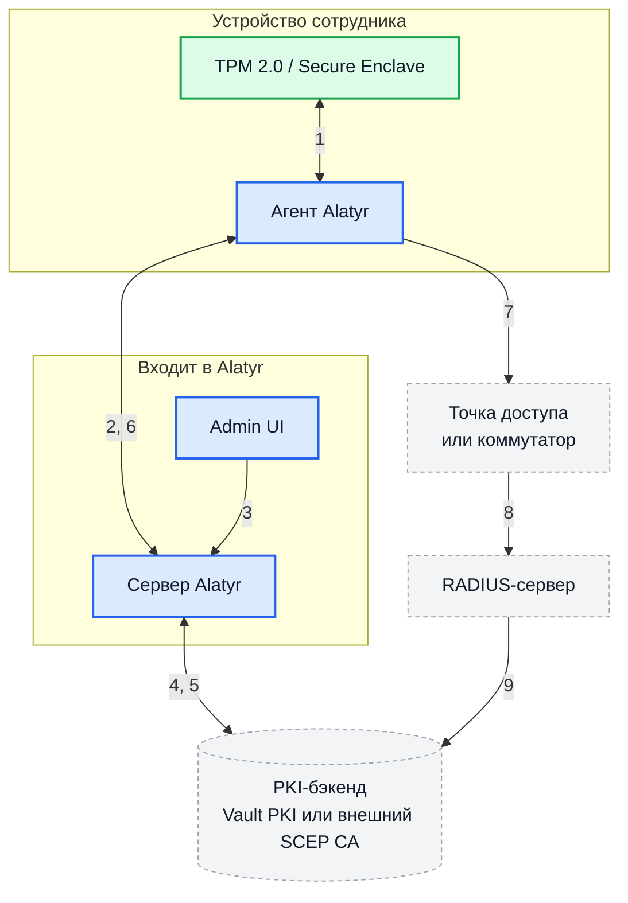
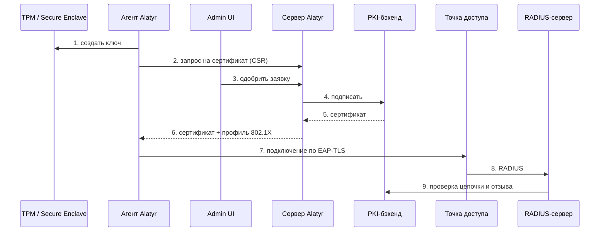
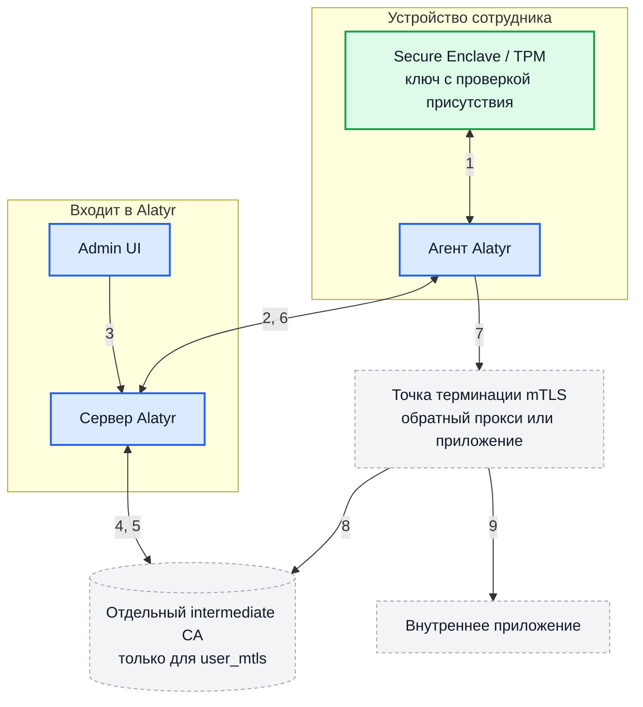
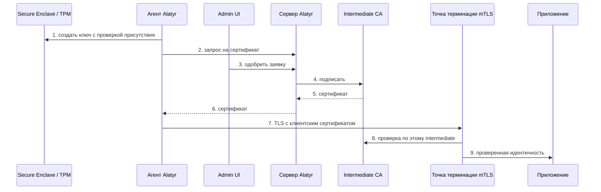
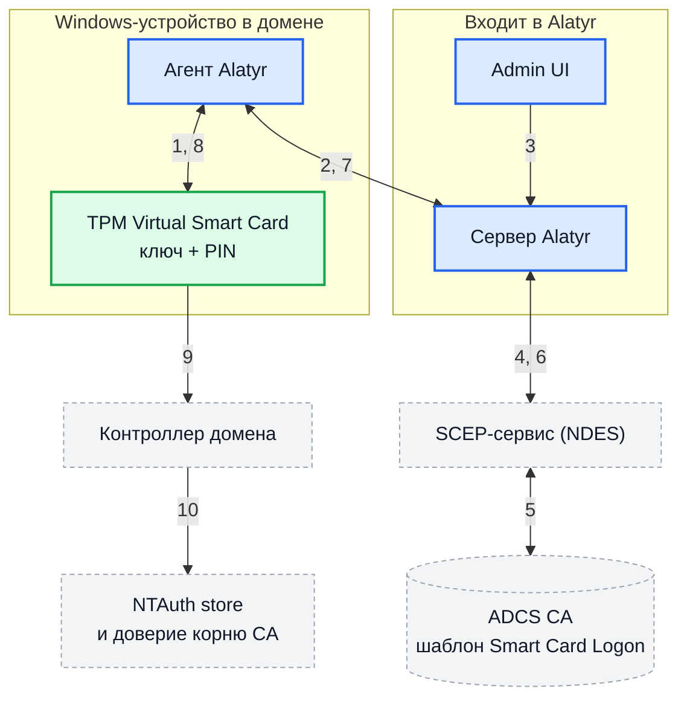
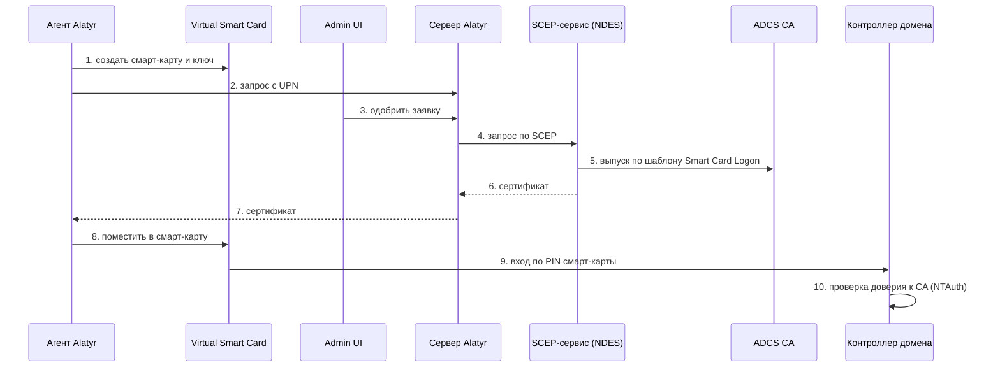
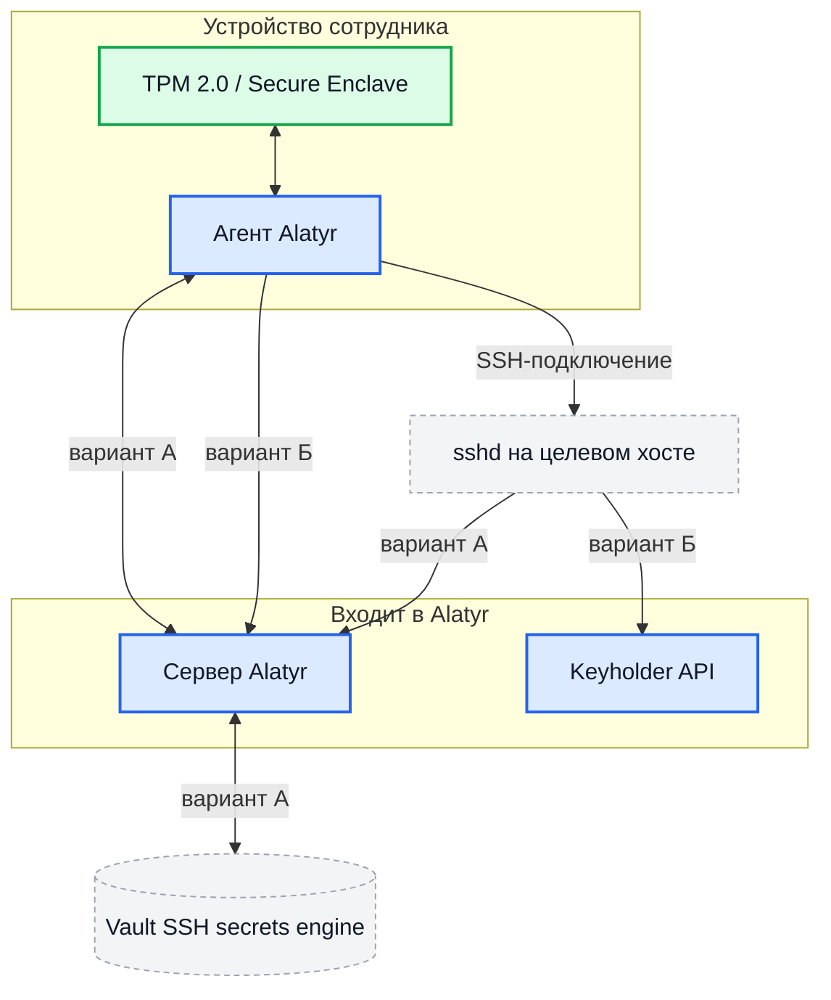
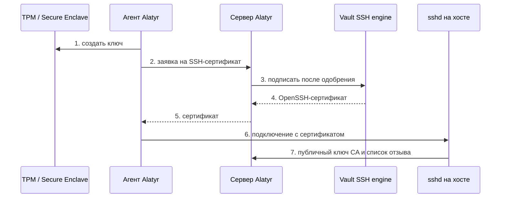
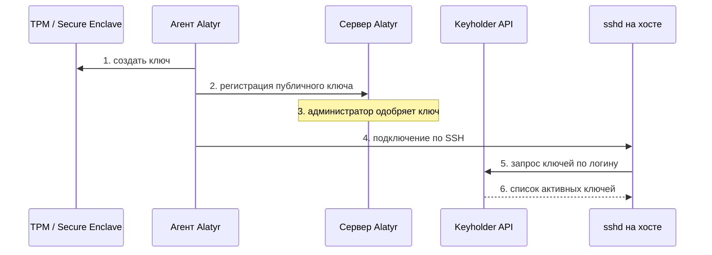

# Сценарии применения

Эта страница отвечает на вопрос «из чего складывается работающее решение
целиком» для каждого из четырёх сценариев, ради которых Alatyr обычно и
внедряют. Для каждого сценария показано, какие компоненты входят в поставку
Alatyr, что заказчик разворачивает и настраивает у себя, и какие варианты
развёртывания существуют. Alatyr выдаёт и отзывает identity-материал — сам по
себе он не заменяет ни RADIUS-сервер, ни Active Directory, ни `sshd`: без этих
компонентов сценарии не работают, и на схемах они показаны явно.

!!! info "Как читать схемы"

    Одна и та же нотация используется на всех схемах ниже:

    - **Синие блоки со сплошной рамкой** — компоненты, входящие в Alatyr:
      сервер (Go + PostgreSQL), агент на устройстве, Admin UI.
    - **Серые блоки с пунктирной рамкой** — то, что заказчик разворачивает и
      администрирует сам: PKI-бэкенд, сетевое оборудование, RADIUS, Active
      Directory, целевые серверы, приложения.
    - **Зелёные блоки** — аппаратное хранилище ключа на самом устройстве
      (TPM 2.0 на Windows/Linux, Secure Enclave на macOS). Приватный ключ
      создаётся там и оттуда не извлекается — наружу уходит только запрос на
      подпись или публичная половина ключа.

    Сервер Alatyr во всех сценариях один и тот же и разворачивается один раз:
    Docker Compose или Helm-чарт для Kubernetes — см.
    [Установка](installation.md). PostgreSQL и PKI-бэкенд — внешние по
    отношению к продукту зависимости, даже когда поставляемые манифесты
    поднимают их «в комплекте» для демонстрации.

## Wi-Fi и проводной доступ по 802.1X (EAP-TLS)

Самый частый сценарий: сотрудники подключаются к корпоративной сети без
общего пароля и без ручной раздачи сертификатов. Устройство доказывает свою
подлинность клиентским сертификатом, приватный ключ которого физически
находится в TPM или Secure Enclave.

### Кто с кем взаимодействует

### В каком порядке это происходит

### Что означает каждый шаг

| № | Шаг | Кто выполняет |
|---|---|---|
| 1 | Агент создаёт ключ в TPM или Secure Enclave; приватная половина остаётся в железе | Alatyr |
| 2 | Агент отправляет запрос на сертификат (CSR) по HTTPS | Alatyr |
| 3 | Администратор одобряет заявку в Admin UI | Alatyr |
| 4 | Сервер запрашивает подпись у PKI-бэкенда | Alatyr → заказчик |
| 5 | PKI-бэкенд возвращает подписанный сертификат | Заказчик |
| 6 | Сервер отдаёт агенту сертификат и профиль 802.1X, агент устанавливает их | Alatyr |
| 7 | Устройство подключается к сети по EAP-TLS | Заказчик (сеть) |
| 8 | Точка доступа передаёт аутентификацию RADIUS-серверу | Заказчик |
| 9 | RADIUS-сервер проверяет цепочку доверия и отзыв (CRL или OCSP) | Заказчик |

| Компонент | Чья зона |
|---|---|
| Агент, генерация ключа в TPM/Secure Enclave, отправка CSR | Alatyr |
| Сервер: заявки, одобрение, выпуск, отзыв, журнал аудита | Alatyr |
| Admin UI: одобрение заявок, список сетей, отзыв сертификатов | Alatyr |
| Установка выданного сертификата и профиля 802.1X на устройство | Alatyr (либо MDM/GPO — см. ниже) |
| PKI-бэкенд (Vault PKI или внешний SCEP CA), публикация CRL/OCSP | Заказчик |
| RADIUS-сервер (FreeRADIUS, NPS, любой другой RFC-совместимый) | Заказчик |
| Точки доступа, коммутаторы, VLAN, RADIUS-клиенты на них | Заказчик |
| PostgreSQL | Заказчик |

**Варианты развёртывания**

- **PKI-бэкенд:** Vault PKI или внешний SCEP CA — настраивается отдельно для
  purpose `wifi`, независимо от остальных целей выпуска. Это единственная
  цель с fallback-поведением: если профиль выпуска не настроен явно,
  используется Vault-issuer из переменных окружения сервера
  ([Архитектура и PKI](architecture.md#pki--ca--per-purpose-registry)).
- **Кто ставит сетевой профиль:** сам агент либо внешний MDM/GPO/config
  management. Для второго случая есть переключатели «не распространять
  профиль агентом» — fleet-wide и отдельно на каждую сеть и ОС
  ([Агенты](agents.md#agent-profile-disabled)).
- **Тип сети:** Wi-Fi и проводной 802.1X настраиваются в одном списке сетей;
  одновременно активной проводной сетью может быть только одна
  ([Администрирование](administration.md)).

**Что потребуется от заказчика.** RADIUS-сервер должен доверять тому же CA,
который подписал клиентские сертификаты, — иначе EAP-TLS не пройдёт. Обратное
требование не менее важно: профиль 802.1X, который распространяет Alatyr,
жёстко закрепляет CA-сертификат как якорь доверия для проверки серверного
сертификата RADIUS и запрещает пользователю принимать недоверенный сертификат
вручную, поэтому серверный сертификат RADIUS тоже должен вести к этому якорю.
Кроме того, RADIUS должен проверять отзыв (CRL или OCSP) — Alatyr отзывает
сертификат у CA, но принудить сетевой сегмент к перепроверке он не может.
Подробнее про выпуск и отзыв — [Архитектура и PKI](architecture.md),
про сети и роли — [Администрирование](administration.md).

## mTLS для внутренних приложений

Клиентский сертификат `user_mtls` выдаётся не машине, а пользователю: ключ
защищён проверкой присутствия (Touch ID, PIN) и лежит в пользовательском
хранилище. Приложение или обратный прокси перед ним аутентифицирует
пользователя по этому сертификату, без пароля.

### Кто с кем взаимодействует

### В каком порядке это происходит

### Что означает каждый шаг

| № | Шаг | Кто выполняет |
|---|---|---|
| 1 | Агент создаёт ключ, защищённый проверкой присутствия (Touch ID, PIN) | Alatyr |
| 2 | Агент отправляет запрос на сертификат | Alatyr |
| 3 | Администратор одобряет заявку — для `user_mtls` одобрение обязательно | Alatyr |
| 4 | Сервер запрашивает подпись у отдельного intermediate CA | Alatyr → заказчик |
| 5 | Intermediate CA возвращает подписанный сертификат | Заказчик |
| 6 | Сервер отдаёт сертификат агенту, агент кладёт его в пользовательское хранилище | Alatyr |
| 7 | Пользователь обращается к приложению по TLS с клиентским сертификатом | Заказчик |
| 8 | Точка терминации mTLS проверяет сертификат по этому intermediate CA | Заказчик |
| 9 | Приложение получает проверенную идентичность пользователя | Заказчик |

| Компонент | Чья зона |
|---|---|
| Выпуск ключа с проверкой присутствия в пользовательском контексте | Alatyr |
| Заявка, обязательное ручное одобрение, выпуск и отзыв | Alatyr |
| Установка сертификата в пользовательское хранилище устройства | Alatyr |
| Отдельный intermediate CA для `user_mtls` в PKI-бэкенде | Заказчик |
| Точка терминации mTLS (обратный прокси или само приложение) | Заказчик |
| Сопоставление идентичности из сертификата с учётной записью в приложении | Заказчик |

**Варианты развёртывания**

- **PKI-бэкенд:** Vault PKI или внешний SCEP CA. В отличие от `wifi`, у
  `user_mtls` нет fallback: без явно настроенного и включённого профиля
  выпуска заявки отклоняются.
- **Где терминируется mTLS:** на обратном прокси перед приложением (тогда
  проверенная идентичность передаётся приложению заголовком, которому оно
  доверяет только от этого прокси) либо непосредственно в приложении.

**Что потребуется от заказчика.** Критично, чтобы `user_mtls` выпускался из
**отдельного** intermediate CA, а не из того же, что `wifi`. Сертификат
`wifi` выдаётся машине и подписывается без всякого участия пользователя;
если проверяющая сторона доверяет общему корню, такой машинный сертификат
станет полноценной заменой пользовательскому — и проверка присутствия,
ради которой всё затевалось, будет обойдена. Поэтому хранилище доверенных CA
на стороне приложения должно содержать именно intermediate для `user_mtls`,
а не корневой сертификат и не связку, через которую проходит и `wifi`.
Настройка целей выпуска описана в
[Архитектуре и PKI](architecture.md#pki--ca--per-purpose-registry); политика
одобрения заявок — в [Администрировании](administration.md).

## Вход в домен Windows по смарт-карте

Purpose `ad_logon` даёт вход в домен Windows по смарт-карте, где роль карты
играет TPM Virtual Smart Card, создаваемая агентом на самом устройстве.
Пользователь входит по PIN виртуальной карты, а не по доменному паролю.

### Кто с кем взаимодействует

### В каком порядке это происходит

### Что означает каждый шаг

| № | Шаг | Кто выполняет |
|---|---|---|
| 1 | Агент создаёт на устройстве TPM Virtual Smart Card и ключ в ней | Alatyr |
| 2 | Агент формирует запрос с UPN и расширениями для доменного входа | Alatyr |
| 3 | Администратор одобряет заявку | Alatyr |
| 4 | Сервер обращается за сертификатом к SCEP-сервису (NDES) | Alatyr → заказчик |
| 5 | NDES выпускает сертификат в ADCS по шаблону Smart Card Logon | Заказчик |
| 6 | Сертификат возвращается серверу | Заказчик |
| 7 | Сервер отдаёт сертификат агенту | Alatyr |
| 8 | Агент помещает сертификат в виртуальную смарт-карту | Alatyr |
| 9 | Пользователь входит в домен по PIN смарт-карты вместо пароля | Заказчик |
| 10 | Контроллер домена проверяет, что CA доверен для доменной аутентификации | Заказчик |

| Компонент | Чья зона |
|---|---|
| Создание TPM Virtual Smart Card на устройстве | Alatyr |
| Формирование запроса с UPN и нужными расширениями, заявка и одобрение | Alatyr |
| Обращение к SCEP-сервису за сертификатом | Alatyr |
| ADCS CA и шаблон сертификата Smart Card Logon | Заказчик |
| SCEP-сервис (NDES), доступный серверу Alatyr | Заказчик |
| Публикация CA в NTAuth store и распространение доверия корню | Заказчик (права Domain Admin) |
| Контроллеры домена, учётные записи, групповые политики | Заказчик |

**Варианты развёртывания**

- **PKI-бэкенд: только SCEP/ADCS.** Vault PKI для этой цели не подходит и
  отклоняется сервером: он не умеет выпускать расширение сертификата,
  обязательное для строгого сопоставления сертификата с учётной записью
  (KB5014754). Это единственная цель выпуска с жёстко зафиксированным
  источником — см.
  [Архитектура и PKI](architecture.md#pki--ca--per-purpose-registry).
- **Платформа: только Windows.** Доменный вход по смарт-карте с macOS в этот
  сценарий не входит.

**Что потребуется от заказчика.** Настройка на стороне Active Directory
принципиально не автоматизируется Alatyr и выполняется администратором домена
один раз на каждый CA: выпускающий CA публикуется в NTAuth store, а его
корень раздаётся как доверенный для входа по смарт-карте на все контроллеры
домена и клиенты. Без этих двух шагов сертификат будет технически корректным,
но Windows отклонит его на экране входа. Заявки `ad_logon` всегда требуют
ручного одобрения администратором. На текущем этапе установка уже выпущенного
сертификата на виртуальную смарт-карту выполняется администратором вручную —
это раскрытое ограничение, а не автоматизированный шаг. Требования к
сертификату и порядок выпуска — [Архитектура и PKI](architecture.md),
поведение агента на Windows — [Агенты](agents.md).

## SSH-доступ

Здесь два независимых механизма, и это именно **альтернативы** — выбирается
один из них, а не оба сразу. Вариант **А**: короткоживущие OpenSSH-сертификаты,
подписанные Vault SSH secrets engine; `sshd` доверяет публичному ключу CA.
Вариант **Б**: **SSH Key Registry** — реестр «сырых» аппаратных публичных
ключей без всякого CA и без сертификатов; `sshd` спрашивает актуальный список
ключей пользователя у Keyholder API.

### Кто с кем взаимодействует

### Вариант А — OpenSSH-сертификаты

| № | Шаг | Кто выполняет |
|---|---|---|
| 1 | Агент создаёт ключ в аппаратном хранилище | Alatyr |
| 2 | Агент отправляет заявку на SSH-сертификат | Alatyr |
| 3 | После одобрения сервер запрашивает подпись в Vault SSH secrets engine | Alatyr → заказчик |
| 4 | Vault возвращает короткоживущий OpenSSH-сертификат | Заказчик |
| 5 | Сервер передаёт сертификат агенту | Alatyr |
| 6 | Пользователь подключается по SSH, предъявляя сертификат | Заказчик |
| 7 | `sshd` проверяет сертификат по публичному ключу CA и списку отзыва (KRL) | Заказчик |

### Вариант Б — реестр «сырых» ключей

| № | Шаг | Кто выполняет |
|---|---|---|
| 1 | Агент создаёт ключ в аппаратном хранилище | Alatyr |
| 2 | Агент регистрирует публичную половину ключа в реестре | Alatyr |
| 3 | Администратор одобряет ключ — без этого он не выдаётся | Alatyr |
| 4 | Пользователь подключается по SSH | Заказчик |
| 5 | `sshd` запрашивает у Keyholder API список ключей этого логина | Заказчик |
| 6 | Keyholder API возвращает только одобренные активные ключи | Alatyr |

| Компонент | Чья зона |
|---|---|
| Аппаратный ssh-agent на устройстве, подпись ключом из TPM/Secure Enclave | Alatyr |
| Вариант А: заявка на сертификат, одобрение, публикация KRL | Alatyr |
| Вариант Б: реестр ключей, allowlist принципалов, Keyholder API | Alatyr |
| Vault с включённым SSH secrets engine (только вариант А) | Заказчик |
| Целевые хосты и настройка `sshd` на них | Заказчик |
| Сетевой доступ от целевых хостов до сервера Alatyr | Заказчик |

**Варианты развёртывания**

- **Вариант А — сертификаты.** Источник выпуска только один: Vault SSH
  secrets engine. У этого механизма нет CRL/OCSP в принципе, поэтому
  единственное средство отзыва — список отозванных ключей в бинарном формате
  OpenSSH (KRL), который `sshd` периодически перечитывает.
- **Вариант Б — реестр ключей.** CA не нужен вообще; `sshd` получает
  актуальный список публичных ключей пользователя через
  `AuthorizedKeysCommand`. Отзыв мгновенный: отозванный ключ просто перестаёт
  возвращаться. Доступ к Keyholder API ограничивается обязательным списком
  разрешённых подсетей (пустой список = эндпоинт закрыт) и, по желанию,
  дополнительным серверным токеном.
- **Одобрение заявок.** Оба варианта по умолчанию требуют ручного одобрения;
  автоодобрение для реестра ключей включается отдельно и по умолчанию
  выключено.

**Что потребуется от заказчика.** Для варианта А — работающий Vault с
включённым SSH secrets engine и настройка `sshd` на доверие публичному ключу
CA плюс регулярное обновление файла KRL. Для варианта Б — настройка `sshd` на
вызов внешней команды за списком ключей и сетевой доступ от целевых хостов
(или bastion-хоста) до Alatyr. Развёрнутое сравнение механизмов, модель
доступа Keyholder API и её задокументированные ограничения —
[SSH Key Registry](ssh-keys.md); список эндпоинтов — [REST API](api.md).

## Что общего у всех сценариев

Во всех четырёх случаях приватный ключ создаётся в аппаратном хранилище
устройства и не покидает его, а каждая заявка по умолчанию попадает в статус
ожидания и требует явного одобрения человеком. Цели выпуска независимы: можно
внедрить только Wi-Fi, добавить mTLS позже, а SSH не использовать вовсе —
каждая цель настраивается на свой источник выпуска отдельно. Дальше по
документации: [Архитектура и PKI](architecture.md) — как устроен выпуск,
[Установка](installation.md) — как развернуть сервер и агенты,
[Расчёт ресурсов](sizing.md) и [Отказоустойчивость (HA)](ha.md) — что учесть
перед продакшеном.
