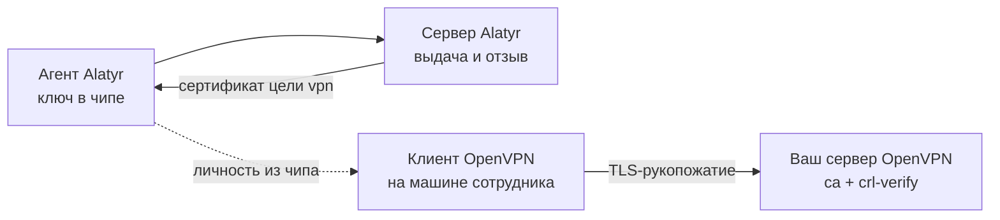

# Доступ по VPN

## Что это такое и что вам даёт

Alatyr выдаёт сотруднику клиентский сертификат для OpenVPN — цель `vpn`.
Закрытый ключ создаётся в чипе устройства и оттуда не извлекается, а клиент
OpenVPN берёт личность прямо из чипа.

Заменяется этим одна практика: выгружаемый `.p12` или пара «ключ + сертификат»
файлами, отправленная сотруднику.

| | Ключ-файл, розданный руками | Цель `vpn` в Alatyr |
|---|---|---|
| Где лежит закрытый ключ | файлом у сотрудника — его копирует каждая резервная копия и каждый клон образа | в чипе устройства: TPM на Windows и Linux, Secure Enclave на Mac |
| Можно ли перенести доступ на другую машину | да, копированием файла | нет: ключ не покидает чип |
| Кто разрешил доступ | тот, кто отправил файл | администратор, одобривший заявку в админке |
| Как забрать доступ | собрать файлы обратно, что невозможно | отзыв сертификата у УЦ Alatyr |

## Почему это отдельная цель, а не `user_mtls`

Заявка и запрос на сертификат у них одинаковой формы, и соблазн выдать один
сертификат на обе цели есть. Разведены они намеренно:

- **Разные приёмники и разная цена ошибки.** Приёмник mTLS — веб-приложение за
  обратным прокси, приёмник VPN — сервер доступа в сеть.
- **Отзыв не должен задевать соседа.** Один сертификат на две цели означал бы,
  что отзыв доступа к внутреннему сайту отбирает и доступ в сеть, и наоборот.
- **Лицензия считает места по цели.** Объединение спрятало бы половину
  использования.
- **Ключ тоже не делится.** Два сертификата на одном ключе неразличимы для
  того, кто ключ открывает; этот отказ уже случался на смарт-карте, причём
  молча с обеих сторон. У цели `vpn` свой ключ и свой ярлык.

## Как это работает

Личность человека, а не машины: сертификат выдаётся тому, кто подключается, и
сервер сверяет заявку с ним, а не с учётной записью устройства. Поэтому заявка
на `vpn` — всегда решение человека: сервисному аккаунту цель `vpn` не разрешена
по умолчанию, её приходится выдавать токену явным списком.

Способ, которым клиент берёт личность, у платформ разный — и это не настройка,
а разные механизмы:

| | Linux | Windows | macOS |
|---|---|---|---|
| Где ключ | токен PKCS#11 поверх TPM (`tpm2-pkcs11`) | контейнер CNG `alatyr-agent-vpn`, `Microsoft Platform Crypto Provider` | Secure Enclave |
| Как клиент его находит | `pkcs11-providers` + `pkcs11-id` | `cryptoapicert "THUMB:<отпечаток>"` из `CurrentUser\My` | модуль PKCS#11 OpenSC через считыватель агента |
| Спрашивается ли PIN | да, PIN токена | нет | — |
| Отчёт `alatyr-agent vpn` | есть | есть | **нет**, команда честно об этом говорит |

Сертификат адресуется **отпечатком**, а не субъектом: у целей `user_mtls`,
`k8s` и `vpn` субъект — один и тот же корпоративный адрес, и поиск по субъекту
нашёл бы первый попавшийся сертификат, то есть чужой цели.

## Что делает Alatyr и что остаётся вам

| Половина | Кто делает |
|---|---|
| Ключ в чипе, заявка, одобрение, выдача, отзыв, журнал | Alatyr |
| Отчёт о готовности и **строки** для профиля клиента | Alatyr (команда `alatyr-agent vpn`) |
| Сам профиль клиента: `remote`, `ca`, маршруты, политика | Вы |
| Сервер OpenVPN, включая `crl-verify` со свежим списком отзыва | Вы |

Профиль клиента продукт **не пишет и не переписывает**: у вас свой сервер
доступа, свои сети и своя политика, и сочинять за вас `remote` и `ca` значило
бы выдавать догадку за настройку. Команда печатает ровно те строки, которые
описывают ключ Alatyr, — их вы добавляете в свой профиль сами.

## Ключ не спрашивает подтверждения человеком

Туннель поднимается службой или вручную, и запрос биометрии на каждое
рукопожатие сделал бы необслуживаемый режим невозможным. Поэтому ключ цели
`vpn` не закрыт подтверждением присутствия ни на одной платформе — намеренно и
одинаково везде.

---

## Куда идти дальше

| Если вам нужно | Читайте |
|---|---|
| Настроить цель с нуля: что нажать в админке и что сделать на машине | [Настройка](setup.md) |
| Настроить серверную сторону OpenVPN | [Приёмники сертификатов](../relying-parties.md#openvpn) |
| Узнать, где путь упирается в клиента, а не в Alatyr | [Нюансы и пределы](caveats.md) |
