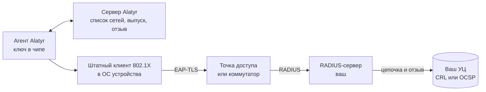

# Wi-Fi и проводной 802.1X

## Что это такое и что вам даёт

Alatyr выдаёт устройству клиентский сертификат и ставит на него профиль
802.1X. После этого устройство подключается к корпоративной сети по EAP-TLS:
без общего пароля и без ручной раздачи сертификатов. Закрытая часть ключа
создаётся **внутри чипа** устройства (TPM 2.0 на Windows и Linux, Secure
Enclave на Mac) и оттуда не извлекается.

Что это меняет на практике:

- **Общего пароля к сети больше нет.** Его нечего забыть при увольнении и
  нечего пересылать в мессенджере.
- **Ключ остаётся на своей машине.** Его нельзя скопировать на флешку или
  перенести на личный ноутбук.
- **Доступ забирается отзывом сертификата** — при условии, что ваш
  RADIUS-сервер проверяет отзыв. Alatyr отзывает сертификат у своего УЦ, но
  принудить сетевой сегмент к перепроверке не может.
- **Wi-Fi и проводной доступ настраиваются в одном месте.** Сертификат у
  обоих типов сети один и тот же — клиентский EAP-TLS.

Wi-Fi-сертификат (цель `wifi`) — базовый машинный ключ: заявка на него
создаётся при каждой регистрации устройства. Своя строка на вкладке
**Настройки → Политика выдачи** у него есть, как и у остальных целей, и по
умолчанию она включена; выключенная означает, что агенты перестают просить
эту цель. Одобрение заявки при этом обязательно — автоматически не выдаётся
ни одна цель.

## Как это работает

Агент создаёт ключ в чипе, получает от сервера Alatyr сертификат и профиль
802.1X и записывает их в хранилище операционной системы. **Дальше агент не
участвует**: подключается штатный клиент 802.1X самой ОС, а решение «впустить
или нет» принимает ваш RADIUS-сервер.

## Что делает Alatyr, а что остаётся вам

| Что | Чья зона |
|---|---|
| Ключ в TPM или Secure Enclave, заявка на сертификат | Alatyr |
| Одобрение заявки, выпуск, отзыв, журнал аудита | Alatyr |
| Список сетей и содержимое профиля 802.1X | Alatyr |
| Установка сертификата и профиля на устройство | Alatyr — либо ваш MDM/GPO, [на выбор](setup.md#agent-profile-disabled) |
| PKI-бэкенд (Vault PKI или внешний SCEP CA), публикация CRL или OCSP | Вы |
| RADIUS-сервер (FreeRADIUS, NPS, любой другой) | Вы |
| Точки доступа, коммутаторы, VLAN | Вы |

Половина на вашей стороне описана отдельно — [«Сторона
RADIUS»](radius.md). Без неё выданный сертификат в сеть не пустит.

## Два типа сети в одном списке

Сети живут в разделе **802.1X сети** админки. У каждой строки есть тип:

| | **Wi-Fi** | **Ethernet** (проводная) |
|---|---|---|
| Что задаёт сеть | SSID | отображаемое имя, привязка к Ethernet-интерфейсу |
| Сколько может быть активных | сколько угодно | **одна** |
| Что ставит агент | профиль на каждую активную сеть | один профиль 802.1X на интерфейс |

Завести несколько проводных сетей можно, активной — только одну: на хосте
один профиль 802.1X на Ethernet-интерфейс. Попытка сделать активной вторую
отклоняется, и админка объясняет почему.

---

## Куда идти дальше

| Если вам нужно | Читайте |
|---|---|
| Завести сеть, раздать профиль на устройства и проверить подключение | [Настройка сети](setup.md) |
| Запретить супликанту принимать любой сервер с сертификатом от вашего УЦ | [Имя RADIUS-сервера](server-name.md) |
| Настроить то, что Alatyr не настраивает: доверие к корню, фрагменты EAP, диагностику | [Сторона RADIUS](radius.md) |
| Узнать, чего механизм не обещает, до того как это выяснится на работающем стенде | [Нюансы и пределы](caveats.md) |

Читать подряд не обязательно. Для запуска достаточно [настройки](setup.md) и
[стороны RADIUS](radius.md); остальное — когда понадобится.
